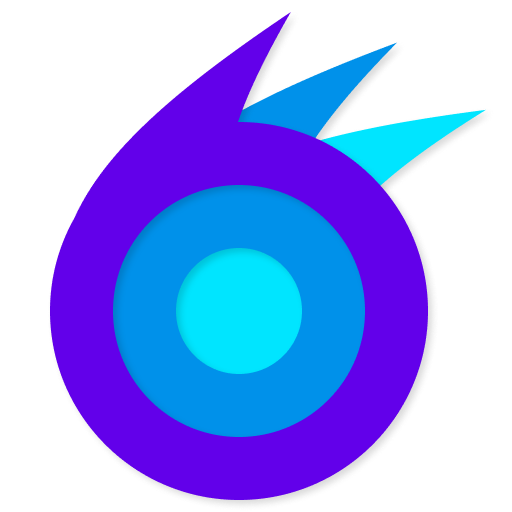
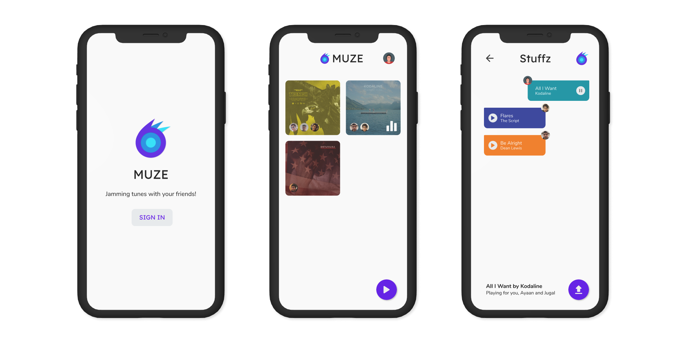

  

<h1 align='center'> Muze </h1>

**NOTE:** this project isn't dead, but development is extremely slow as I'm busy with my full-time job. I'll continue to work on Muze as and when I'm free.

## About

Jam tunes with your friends! Muze can be thought of as a [Netflix Party](https://www.netflixparty.com/) for music. The idea is to create 'rooms' which your friends can join and send music to. Anyone can play/pause a track which will then be play/paused for everyone in realtime.

Muze is my personal project inspired by social distancing norms during the 2020 Coronavirus pandemic. I can't listen to music with my friends anymore and this app aims to solve that!

## Prototype

I've made a simple prototype of the app on Figma, which you can view [here](https://www.figma.com/file/son6xQvcS1tEbm1lRPS7Uh/Muze-Prototype?node-id=0%3A1). I'm not a designer, so if you would like to improve it, please [contact me](https://urmilshroff.tech/)!

  

## Building

To build and run the app on your device, do the following:

-   [Install Flutter](https://flutter.dev/docs/get-started/install/) by following the instructions on their website.
-   Fork/clone this repo to your computer using `git clone https://github.com/urmilshroff/muze.git`.
-   Create a Firebase project from the [console](https://console.firebase.google.com/) and set it up for Android/iOS.
-   Connect your devices/emulators and run the app using `flutter run` in the root of the project directory.

## Implementation

The app is made using [Flutter](https://github.com/flutter/flutter) with [Provider](https://pub.dev/packages/provider) for state management and as much modularity as possible in an effort to follow clean architecture practices. The backend is [Firebase](https://console.firebase.google.com/) and local storage uses [Hive](https://pub.dev/packages/hive). There is a lot of scope for improvement, so contributions are more than welcome!

## Contributing

The frontend of the app is 100% open source and I'd love if you could contribute to it! Please see the [contributing guidelines](CONTRIBUTING.md) for more details.

## License

Muze is licensed under the MIT License - see the [license file](LICENSE) to learn more.
